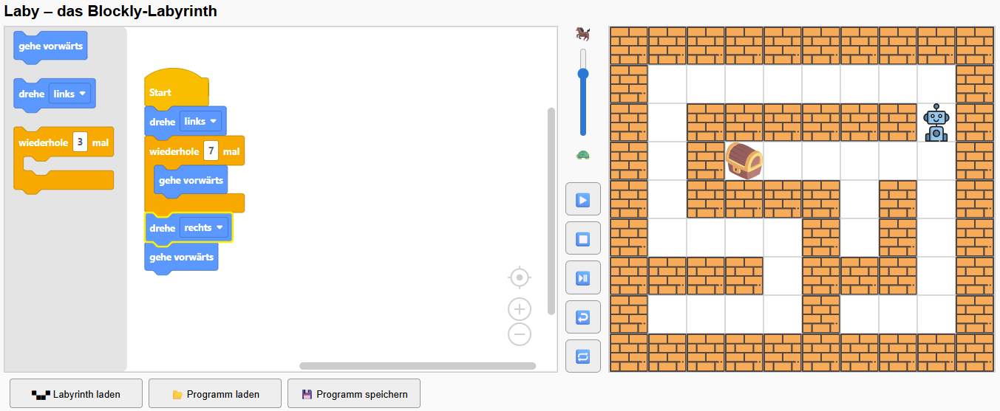

# 🧱 Blockly-Labyrinth

Führe einen Roboter mithilfe der blockbasierten Programmierung durch das Labyrinth. Nutzer:innen können über Blöcke einen Roboter steuern und zur Schatzkiste führen.

## 🔍 Funktionen

- Blockly-Editor mit Blöcken zum Bewegen und einem Schleifenblock zum Steuern des Roboters
- Schrittweiser oder vollständiger Programmlauf mit Hervorhebung des aktuellen Blocks
- Einstellen der Ablaufgeschwindigkeit
- Labyrinth austauschbar - Entwickle eigene Labyrinthe mit dem [Laby-Editor](https://github.com/ToniTaste/Laby-Editor)
- Speichern/Laden des Programmcodes als XML
- Konfiguration in den Dateien im Ordner data durch Lehrkraft anpassbar

## 🖼️ Screenshot



## 🚀 Online ausprobieren

> Wird unterstützt durch **GitHub Pages**.

👉 [Hier klicken, um das Projekt direkt im Browser zu starten](https://ToniTaste.github.io/Laby/)

## 📦 Installation (lokal)

Du kannst das Projekt lokal und ohne Internetzugang betreiben. Lade dazu alles über Code - Download ZIP herunter, entpacke das Archiv in einen Ordner und öffne `index.html` in einem Browser. Alternativ kannst du auch so vorgehen:

```bash
git clone https://github.com/ToniTaste/Laby.git
cd Laby
# Dann: index.html im Browser öffnen
```

## Grafikquellen
Vectors and icons by <a href="https://www.svgrepo.com" target="_blank">SVG Repo</a>
- robot.svg - COLLECTION: Universe 17, LICENSE: CC0 License, UPLOADER: SVG Repo
- treasure.svg - COLLECTION: Lechazo Conf Flat Vectors, LICENSE: CC Attribution License, AUTHOR: lechazoconf
- brickwall.svg - COLLECTION: Architecture Construction, LICENSE: CC0 License, UPLOADER: SVG Repo
